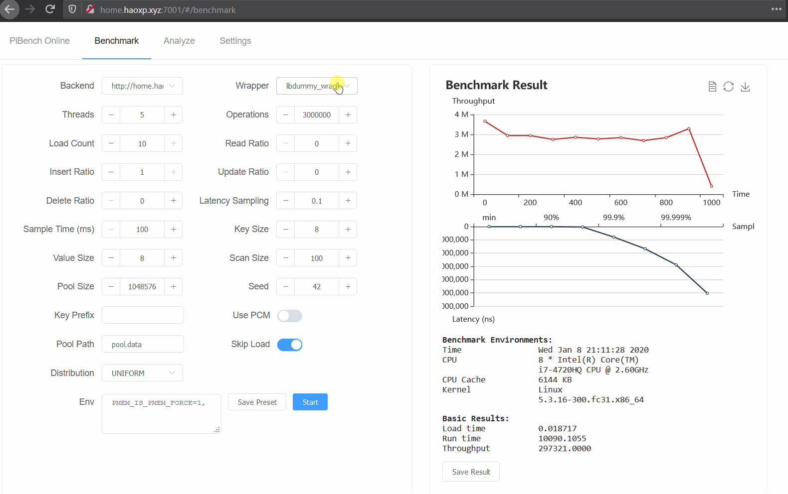

# PiBench Online 

[](https://travis-ci.org/sfu-dis/pibench-online)

## What is PiBench Online?

PiBench Online is an interactive system for benchmarking PM indexes in a fair and reproducible manner, it is based on [PiBench](https://github.com/sfu-dis/pibench), the first unified, highly customizable benchmarking framework for PM indexes.

PiBench Online enables push-button evaluation of PM indexes: the user can upload a shared library that implements the index, set parameters to run customized benchmarks, and analyze results interactively, all through an easy-to-use web interface. We hope it can promote fair comparison and reproducibility in future PM index research

Check out a demo video [here](https://www.cs.sfu.ca/~tzwang/pibench-demo-video.webm) and try it out at http://pibench.org. Use the code in this repo to deploy your own.




## Deploy your own instance

Pibench Online allows you to deploy a server instance on your own machine and connect it with the pibench online web interface (http://pibench.org).

You can either clone the code and build from source (see below), or simply use our official [docker image]().

### Docker
```bash
# 1. Pull the pibench-online image from docker hub
# 2. connect the host's port 8000 with container's port 8000
#    so users can access the web api from host's 8000 port
docker run -p 127.0.0.1:8000:8000 pibench-online:latest
```

### Bare metal 
```bash
cargo run --release
```


## About Us

PiBench Online is built by: [Xiangpeng Hao](https://haoxp.xyz), [Tianzheng Wang](https://www2.cs.sfu.ca/~tzwang/) (Simon Fraser University), [Lucas Lersch](https://llersch.github.io/) (TU Dresden & SAP SE) and Ismail Oukid (Snowflake Computing).

If you use PiBench Online in your work, please cite our VLDB 2020 demo paper:

````
Xiangpeng Hao, Lucas Lersch, Tianzheng Wang, Ismail Oukid:
PiBench Online: Interactive Benchmarking of Persistent Memory Indexes. PVLDB 13 (2020)
````

Our own range index evaluation using PiBench is presented in the following [VLDB 2020 paper](http://www.vldb.org/pvldb/vol13/p574-lersch.pdf):
````
Lucas Lersch, Xiangpeng Hao, Ismail Oukid, Tianzheng Wang, Thomas Willhalm:
Evaluating Persistent Memory Range Indexes. PVLDB 13(4): 574-587 (2019)
````

Request PiBench resources: support@pibench.org

## Contribution

### Backend 
The backend server requires rust nightly, which you can install from [rustup](https://rustup.rs/) 

When rust toolchain is properly setup, building pibench online is as simple as:

```bash
cargo build [--release]
```

### Frontend

The PiBench Online frontend requires nodejs and the yarn package manager.

You also need to be familiar with [Vue.js](https://vuejs.org/) and [ElementUI](https://element.eleme.io/#/en-US) as well as [Echarts.js](echartsjs.com/).


#### Project setup
```
yarn install
```

#### Compiles and hot-reloads for development
```
yarn serve
```

#### Compiles and minifies for production
```
yarn build
```
